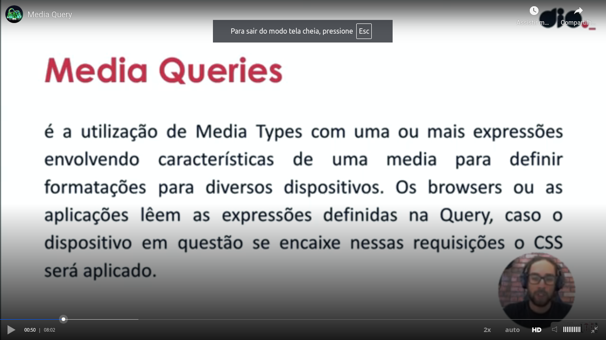
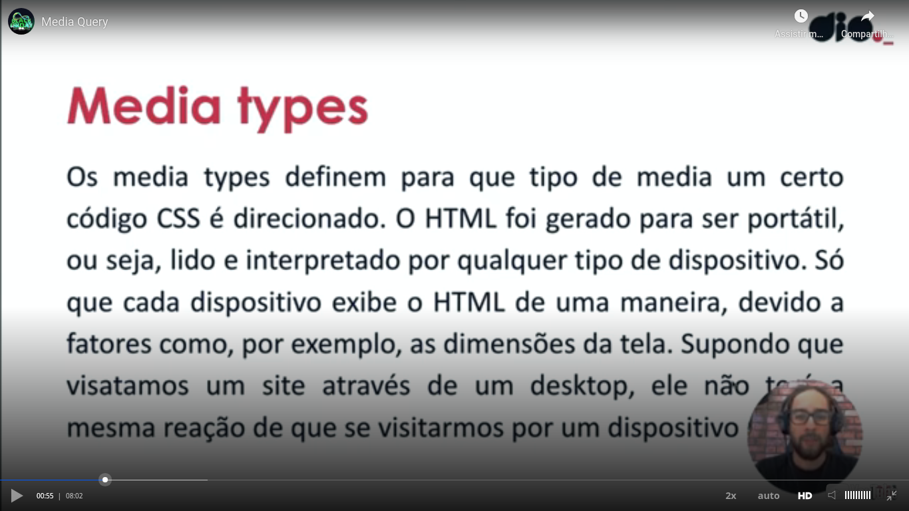

# Selectors

In the next image you can see examples of selectors. In this image was used a selector of an anchor (tag "&lt;a&gt;) with the attribute title of another anchor, in this case with a specific "href" property (with its value).

# Flexbox

Definition:

[w3.org page](https://www.w3.org/TR/css-flexbox-1/) about flexbox.

[Wikipedia definition](https://pt.wikipedia.org/wiki/CSS_Flexible_Box_Layout)

> O CSS Flexible Box Layout, conhecido como Flexbox, é um modelo de layout da Web CSS3. Está no estágio de recomendação de candidatos (CR) do W3C. O layout flexível permite que os elementos responsivos dentro de um contêiner sejam organizados automaticamente, dependendo do tamanho da tela (ou dispositivo).[1]

# Flexbox axises

Flexbox main axis:

Flexbox transversal axis:

In the next image teacher used "flex-direction: column" in CSS to have the boxed elements in the vertical axis. Without this modification, the box elements would be in the horizontal axis.

If you wanna study more about fkexbox, please review [this class](https://web.dio.me/course/estilizando-paginas-com-css/learning/1bd2ecf0-2b5c-403a-aea2-a48d28ea272a?back=/track/formacao-react-developer&tab=undefined&moduleId=undefined).

# Pseudo CSS classes

They are modifiers like ":hover".

If you change the cursor CSS property of an element to "pointer", the pointer will be a hand.

Some CSS pseudo classes are specifically related to some elements, like "focus" is related to an input element.

"nth-child(1)" (1 is an example) is an example of another pseudo CSS modifier.

Remember that you can use more than one CSS selector in the same time, see:

# Media query

Media query and media type definitions

